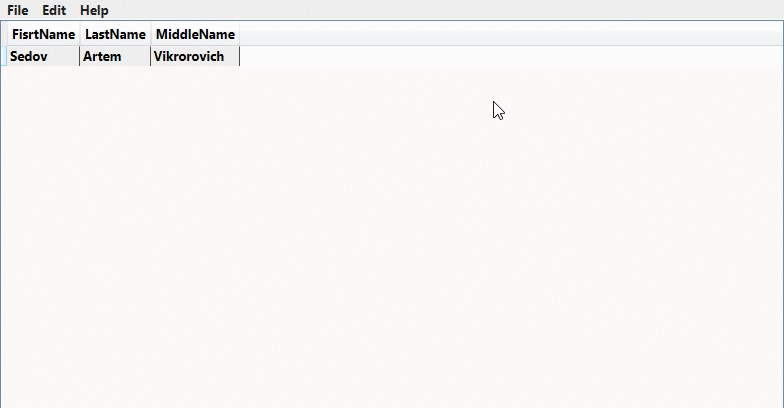
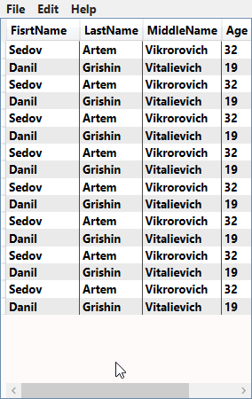
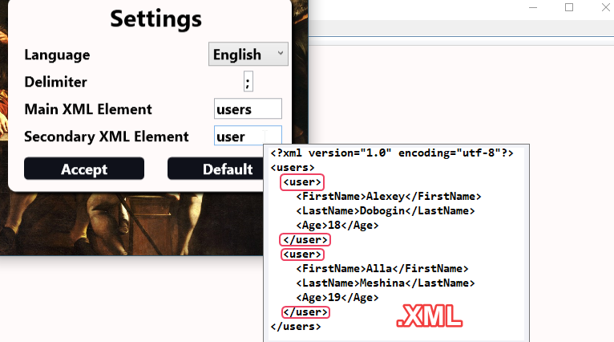
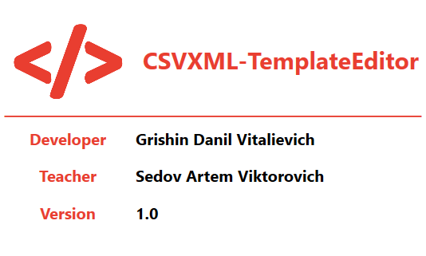

# CSVXML-TemplateEditor
## Welcome

___
## Functionality (Функциональность)
##### This program can edit, convert, and create csv and xml files.
##### Данная программа может редактировать, конвертировать и создавать csv и xml файлы.

___
### Edit (Правка)
##### You can change the contents of the tables.
##### Возможность менять значения в таблицах.

___
### Settings (Настройки)
##### It is possible to change program settings with prompts.
##### Можно изменить настройки программы с помощью подсказок.

___
### Create (Создание)
##### The user can create a table with their own columns and rows, convert it to XML and CSV, and then edit it.
##### Пользователь может создать таблицу со своими собственными столбцами и строками, преобразовать ее в XML и CSV, а затем отредактировать.

___

