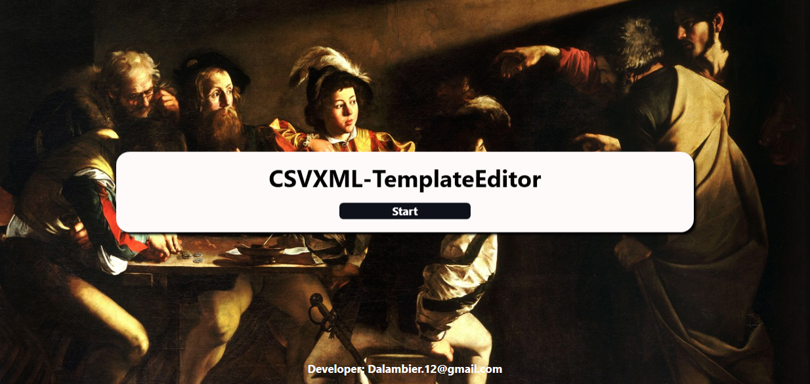
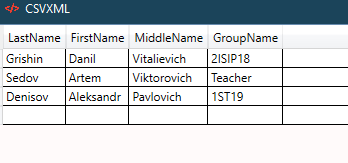
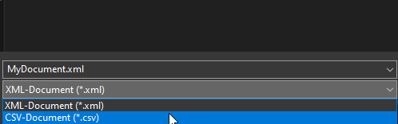

# CSVXML-TemplateEditor
## Welcome

___
## Functionality
**This program can edit, convert, and create csv and xml files.**
___

### Edit
**You can change the contents of the tables.**
___

### Convert
**Ability to convert from XML to CSV and back.**
___

### Create
**The user can create a table with their own columns and rows, convert it to XML and CSV, and then edit it.**
___

